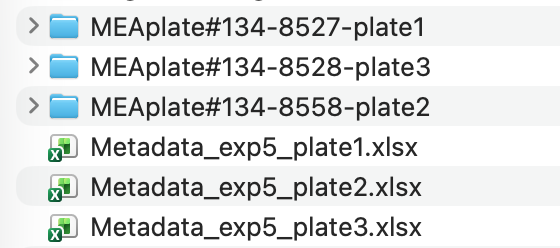
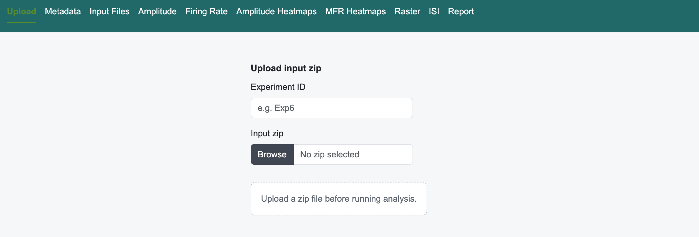
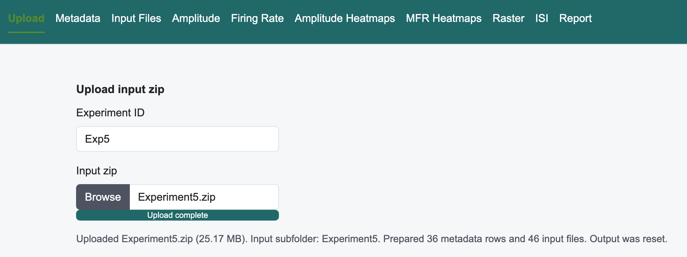
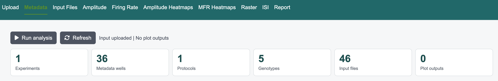

# MEA Shiny Analysis

Shiny app for running the MEA baseline analysis and browsing its metadata, 
plots, rendered HTML report, and downloadable output archive.

## Contents

- `app.R` - Shiny UI/server, upload handling, report rendering, and result gallery.
- `deploy.R` (optional) - Deployment code (`shiny::runApp(".")`)
- `analysis/MEA_organoids_spont_basesline_local_paths.Rmd` - Analysis code used by the app.
- `env.archived.yaml` - Exported conda environment

## Requirements

R with the packages listed in `env.archived.yaml`.

Optional Conda setup:

```sh
conda env create --name shiny --file env.archived.yaml
conda activate mea-shiny
```

## Run

```sh
$ Rscript deploy.R
```

or from R:

```r
shiny::runApp(".")
```

## Input Format

Upload a `.zip` through the app. The zip should contain top-level metadata `.xlsx` files
and MEA plate folders whose names include `plate1`, `plate2`, etc, as shown in the 
following screenshot:



Specify the _Experiment ID_ and path to the `.zip` file in the _Upload_ page:





In the backend, the app stores the zip under `input/` and extracts it into 
`input/<zip-name>/` for analysis.

## Analysis

Once the input is successfully loaded, run the analysis in the _Metadata_ page:



## Output

The analysis writes plots, the rendered HTML report, and `report.zip` to `output/`. The Shiny tabs show metadata, input files, amplitude and firing-rate plots, heatmaps, raster plots, ISI plots, and report download links.
